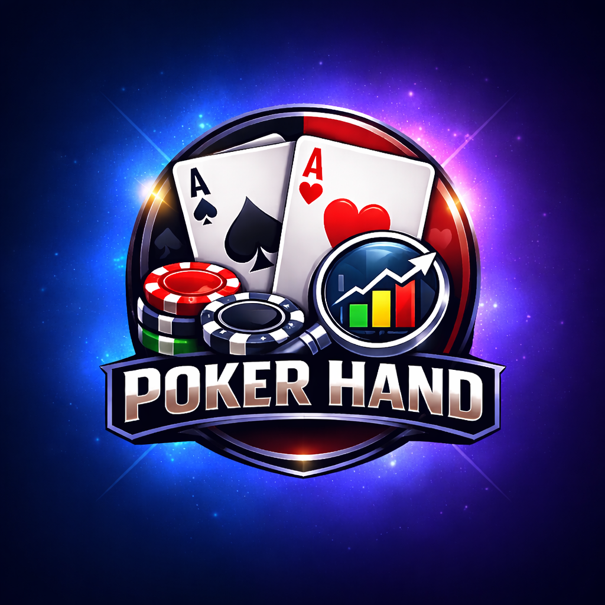

<<<<<<< HEAD
# 🃏 Poker Hand Evaluator

<div align="center">



**A beautiful, real-time poker hand evaluation app built with Flutter**

[](https://flutter.dev)
[](https://dart.dev)
[](LICENSE)

[Features](#-features) • [Installation](#-installation) • [Usage](#-usage) • [Tech Stack](#-tech-stack) • [Contributing](#-contributing)

</div>

---

## 📖 The Story Behind

During poker games at **Chewata Awaqi x ALX Ethiopia**, we realized we lacked proper knowledge of poker hand evaluation. We were constantly searching the internet for hand rankings and comparisons. That's when I decided to create this app - a tool we could use right at the table to instantly evaluate hands and learn poker better while playing.

**Poker for me** is a way to aura farm (especially around the huzz 😎). I take risks and bluff big time - it's pure adrenaline with a reward at the end!

---

## ✨ Features

### 🎯 Core Functionality
- **Real-Time Hand Evaluation** - Instantly evaluate your poker hands as you select cards
- **Best Hand Detection** - Automatically finds the best 5-card combination from your hole cards and community cards
- **Winning Card Highlights** - Visual highlighting of cards that make up your winning hand
- **Complete Hand Rankings** - From Royal Flush to High Card, all hand types supported
- **Hand Strength Indicator** - Color-coded suggestions (Very Strong, Medium, Weak)

### 🎨 Beautiful UI/UX
- **Glassmorphism Design** - Modern, elegant glass-effect UI components
- **Light & Dark Themes** - Seamless theme switching with system preference support
- **Smooth Animations** - Polished transitions and micro-interactions
- **Responsive Layout** - Works beautifully on all screen sizes

### 📊 Additional Features
- **Hand History** - Track your last 10 evaluated hands with timestamps
- **Interactive Card Picker** - Easy-to-use card selection interface
- **Poker Hand Rankings Reference** - Always-visible reference guide for learning
- **About Section** - Learn about the app's origin and developer

---

## 🚀 Installation

### Prerequisites
- Flutter SDK (3.9.2 or higher)
- Dart SDK (3.9.2 or higher)
- Android Studio / VS Code with Flutter extensions
- Git

### Steps

1. **Clone the repository**
   ```bash
   git clone https://github.com/benjamin-bekele/poker-hand-evaluator.git
   cd poker-hand-evaluator
   ```

2. **Install dependencies**
   ```bash
   flutter pub get
   ```

3. **Run the app**
   ```bash
   flutter run
   ```

### Build for Production

**Android APK:**
```bash
flutter build apk --release
```

**iOS:**
```bash
flutter build ios --release
```

**Web:**
```bash
flutter build web --release
```

---

## 🎮 Usage

### Evaluating a Hand

1. **Select Your Hole Cards** - Tap the two empty slots under "Your Hand" to select your cards
2. **Select Community Cards** - Tap the five empty slots under "Community Cards" to add the board
3. **Evaluate** - Press the "EVALUATE" button to see your best hand
4. **View Results** - Your best hand will be displayed with highlighted winning cards

### Viewing History

- Tap the **History icon** (📜) in the top-right corner to view your recent hands
- Tap any history entry to reload that hand configuration

### Changing Themes

- Tap the **Theme icon** (☀️/🌙) to cycle through Light → Dark → System themes

### Learning Hand Rankings

- Scroll down to see the complete poker hand rankings reference
- Each ranking shows the hand name, description, and example

---

## 🛠️ Tech Stack

### Frontend
- **Flutter** - UI framework
- **Dart** - Programming language
- **Material 3** - Design system

### Key Packages
- `url_launcher` - Opening external links
- `google_fonts` - Custom typography
- `font_awesome_flutter` - Icon library

### Architecture
- **State Management** - StatefulWidget with setState
- **Design Pattern** - Component-based architecture
- **Theme Management** - InheritedWidget for theme state

---

## 🎯 Poker Hand Rankings

The app evaluates all standard poker hands:

1. 👑 **Royal Flush** - A, K, Q, J, 10 of the same suit
2. 💎 **Straight Flush** - 5 cards in sequence, same suit
3. 🎯 **Four of a Kind** - 4 cards of the same rank
4. 🏠 **Full House** - 3 of a kind + pair
5. 🌊 **Flush** - 5 cards of the same suit
6. 📊 **Straight** - 5 cards in sequence
7. 🎲 **Three of a Kind** - 3 cards of the same rank
8. 👥 **Two Pair** - 2 different pairs
9. 🎴 **One Pair** - 2 cards of the same rank
10. 🃏 **High Card** - Highest card wins

---

## 👨‍💻 About the Developer

**BENJAMIN BEKELE**  
Software Engineer/Developer & Linguistics Enthusiast

### Specialties
- Mobile App Development (Flutter/React Native)
- Web Development (Frontend/Backend)

### Tech Stack
- **Languages:** Dart, Python, JavaScript, PHP
- **Frameworks:** Flutter, React, Next.js, Node.js, Express
- **Spoken Languages:** Amharic, English, Spanish (+ learning more!)

### Connect With Me
- 🌐 Website: [benjaminbekele.vercel.app](https://benjaminbekele.vercel.app)
- 💼 LinkedIn: [benjaminbekelealemuTelegram](https://linkedin.com/in/benjaminbekelealemuTelegram)
- 🐙 GitHub: [@benjamin-bekele](https://github.com/benjamin-bekele)
- 📧 Email: mr.benjaminbekele@gmail.com
- 📱 Telegram: [@benjamin_bekele](https://t.me/benjamin_bekele)
- 🐦 Twitter: [@benjamin_bekele](https://twitter.com/benjamin_bekele)
- 📸 Instagram: [@benjamin_bekele](https://instagram.com/benjamin_bekele)

---

## 🤝 Contributing

Contributions are welcome! This is an open-source project built with ❤️.

### How to Contribute

1. Fork the repository
2. Create a feature branch (`git checkout -b feature/AmazingFeature`)
3. Commit your changes (`git commit -m 'Add some AmazingFeature'`)
4. Push to the branch (`git push origin feature/AmazingFeature`)
5. Open a Pull Request

### Ideas for Contributions
- 🎨 UI/UX improvements
- 🐛 Bug fixes
- 📱 Platform-specific optimizations
- 🌍 Internationalization (i18n)
- 🎮 New features (multiplayer comparison, odds calculator, etc.)
- 📚 Documentation improvements

---

## 📝 License

This project is licensed under the MIT License - see the [LICENSE](LICENSE) file for details.

---

## 🙏 Special Thanks

- **God** - For the inspiration and guidance
- **Myself** - For the dedication and hard work
- **My Poker Jemma** - For the motivation and support
- **Chewata Awaqi x ALX Ethiopia** - Where it all began

---

## 📸 Screenshots

<div align="center">

### Light Theme


### Dark Theme


### Hand Evaluation


### History Dialog


</div>

---

## 🎯 Roadmap

- [ ] Add multiplayer hand comparison
- [ ] Implement poker odds calculator
- [ ] Add hand strength percentages
- [ ] Support for different poker variants (Omaha, etc.)
- [ ] Add tutorial/onboarding flow
- [ ] Implement hand replay feature
- [ ] Add statistics and analytics
- [ ] Cloud sync for history across devices

---

## 💬 Feedback

Have ideas or feedback? DM me on any platform! I'd love to hear your suggestions to make this app even better.

---

<div align="center">

**Made with ❤️ and ♠️♥️♦️♣️ by Benjamin Bekele**

⭐ Star this repo if you find it helpful!

</div>
=======
# Poker-Hand-Evaluator
A powerful poker hand evaluator that shows your hand in real-time and evaluates it instantly. Built to help players understand poker hands better and make informed decisions at the table.
>>>>>>> 94eef185576b3338cd14f0eab56097aca04c6c9a
